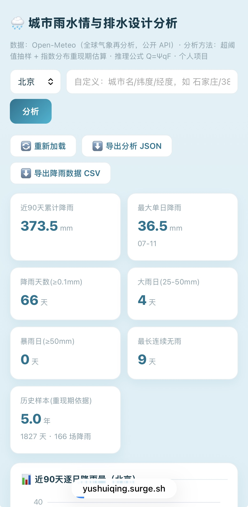

# 🌧 城市雨水情与排水设计分析看板

[English](README_EN.md) | **中文**



给排水科学与工程专业个人项目：基于公开气象数据的**城市降雨分析与雨水排水设计估算**。

## 项目亮点

- **真实数据管线**：Python 脚本自动采集 Open-Meteo 公开 API（**近 5 年历史逐日降雨**（ERA5 再分析）+ 未来 7 天预报），自动归档 CSV/JSON，可重复运行
- **专业分析方法**（区别于普通"天气网站"的核心）：
  - 降雨等级统计（小雨/中雨/大雨/暴雨，按气象标准）
  - **设计暴雨重现期估算**：基于近 5 年历史样本，超阈值抽样（POT）+ 指数分布拟合，估算 2/5/10/20 年一遇 24h 设计雨量
  - **雨水设计流量估算**：推理公式 Q = Ψ·q·F（径流系数、汇水面积、重现期可交互调节），初选排水管径
- **前端交互**：ECharts 可视化（90 天降雨、重现期曲线、7 天预报、逐小时降雨）+ 参数敏感性调节 + 导出 JSON/CSV
- **快加载架构（v2.3+）**：90 天数据秒开渲染 + 后台自动加载近 5 年历史升级分析（6h 缓存，弱网/手机友好）
- **移动端提速（v2.4）**：ECharts 按需打包瘦身（1MB→579KB）+ 多 CDN 四级降级（staticfile→jsdelivr→本地→bootcdn），手机端秒开
- **双端交叉验证**：Python 管线与前端计算结果一致，数据可复现
- **排水管网水力模型（v2.5 新增）**：基于 SWMM 5.2 建立**概化小区管网模型**（服务面积 5 ha、7 段管道 DN300~DN600），
  用本项目的短历时 POT 设计雨量做设计暴雨校核，并逐级放大雨型**量化内涝临界雨量（约 65 mm/2 h）**作为防涝预警阈值
- **公网部署**，手机可访问

## 目录结构

```
├── index.html                    # 看板前端（单文件，ECharts 经国内 CDN 加载）
├── fetch_rain.py                 # 数据采集与分析管线（纯 Python 标准库）
├── data/                         # 归档的逐日降雨 CSV（运行脚本后生成）
├── analysis_*.json               # 脚本输出的分析报告（运行脚本后生成）
├── hourly_storm_analysis.py      # 短历时暴雨频率分析（1~24 h，POT 含去丛）★v2.5
├── calibrate_design_storm.py     # 设计雨型参数率定（1 h/2 h 比值控制）★v2.5
├── swmm_network_model.py         # SWMM 管网水力模型 + 内涝临界扫描 ★v2.5
├── swmm_report.py                # 管网模拟结果报告与出图 ★v2.5
└── out/                          # 分析产物：结果文档与图 ★v2.5
```

## 使用方法

```bash
# 采集并分析任意城市（城市名 纬度 经度 [年数，默认5]）
python fetch_rain.py 张家口 40.768 114.886
python fetch_rain.py 北京 39.904 116.407 8
```

前端看板直接打开 `index.html` 或访问在线地址，支持下拉切换城市/自定义经纬度。

## 排水管网水力模型（SWMM，v2.5 新增）

用 SWMM 5.2 对**概化住宅小区管网**做设计暴雨校核与内涝风险评估，把"设计流量估算"推进到"管网水力校核"。

| 脚本 | 作用 |
|---|---|
| `hourly_storm_analysis.py` | 短历时暴雨频率分析（1/2/3/6/24 h）：超阈值抽样（POT）+ **去丛** + 指数分布拟合 |
| `calibrate_design_storm.py` | 用 POT 的「1 h/2 h 雨量比值」反求芝加哥雨型参数 (b, n)，保证雨型与设计值**内部一致** |
| `swmm_network_model.py` | 建管网模型 → 2/5/10/20 年一遇设计暴雨校核 → 内涝临界雨量扫描 |
| `swmm_report.py` | 生成 `out/SWMM_管网模拟结果.md` 与 `out/图_管网模拟.png` |

```bash
python hourly_storm_analysis.py                              # 短历时频率分析（需逐小时降雨）
python calibrate_design_storm.py                             # 率定雨型参数
uv run --with pyswmm   python swmm_network_model.py          # 跑 SWMM（自动装引擎）
uv run --with matplotlib python swmm_report.py               # 出报告与图
```

**模型口径**：管网为按常规小区布置形式**概化**的管网（服务面积 5.00 ha，综合径流系数约 0.60，
7 座检查井 + 7 段管道 DN300~DN600，井深 2.5 m，糙率 n=0.013），**非实测 GIS 拓扑**；
用途为方案级校核与内涝风险比较，不用于施工图设计。

**主要结论（北京案例）**：

- 20 年一遇设计暴雨下 3/7 段管道由无压满流转为**承压运行**（最大满流比 1.60）；实测最不利过程下达 **2.71**；
- **内涝临界雨量约 64.6 mm/2 h**（2 h 平均雨强约 32.3 mm/h），约为 20 年一遇设计值的 2.0 倍，可作防涝预警阈值；
- 管网按「24 h 雨量平均强度」初选管径，而短历时峰值强度可达平均强度的数倍——说明**用平均强度估算设计流量会低估峰值流量**。

**局限**：① 管网为概化管网，非实测 GIS；② ERA5 逐小时数据无法分辨小时内雨强脉动，短历时（&lt;1 h）峰值存在低估；
③ 雨型参数由 POT 的 1 h/2 h 比值率定，与当地实测雨型仍有差异；④ 样本 5.75 年，POT 重现期估计置信区间较宽
（同重现期下逐日口径与逐小时口径的 24 h 设计雨量相差约 12%）；⑤ 未考虑管网沉积、堵塞与地下水入渗。
正式设计应采用当地 ≥20 年暴雨资料与当地暴雨强度公式（GB 50014）。

## 项目自检

```bash
python verify.py    # 或 npm test —— 28 项断言（另加 workflow YAML 语法校验需 pyyaml，装了则 29 项）：
                    # 前端静态校验 + 工作流校验 + Python/JS 双端数值交叉验证 + 数据完整性
uv run --with pyyaml python verify.py    # 含 YAML 语法校验（29 项）
```

## 数据自动更新

仓库内置 GitHub Actions 工作流（`.github/workflows/daily-data-update.yml`）：每天北京时间 06:00 云端自动采集三城最新降雨数据并提交，无需本地运行。

## 在线访问

- 主地址：https://yushuiqing.surge.sh
- 备用地址：https://lele-dawang.github.io/city-rainfall-analysis/（GitHub Pages，主地址异常时可访问）

## 分析方法与假设（如实声明）

| 步骤 | 方法 | 依据 |
|---|---|---|
| 数据样本 | 近 5 年逐日降雨（ERA5 再分析，archive API） | 可自由回溯 1940 年至今 |
| 重现期估算 | 超阈值法(POT)，阈值 u=5mm；超出量拟合指数分布 x_T = u + β·ln(T·λ) | 极值统计常用简化方法 |
| 设计暴雨强度 | q = P_T/24（24h 平均强度近似） | 简化假设；正式设计用当地暴雨强度公式 q=A(1+C·lgP)/(t+b)ⁿ |
| 设计流量 | 推理公式 Q = Ψ·q·F | GB50014-2021《室外排水设计标准》 |
| 管径初选 | 满流圆管，n=0.013，v=1.0 m/s | 常规排水管设计经验流速 |

**局限性声明**：基于近 5 年样本的估算仅用于学习与演示（20 年一遇等长重现期仍需更长资料支持），正式设计必须采用当地多年（≥20 年）暴雨资料与当地暴雨强度公式，并按规范复核。

## 技术栈

Python（urllib/json/csv，无第三方依赖）· HTML/CSS/JS · ECharts 5 · Open-Meteo API · surge.sh 部署

## 版权与许可

© 2026 乐乐大王 · 除本人授权外禁止商用

本项目采用 [PolyForm Noncommercial License 1.0.0](LICENSE)（非商业许可）：
- ✅ 允许：个人学习、教学、学术研究等**非商业性**使用、修改与分享（需保留本许可与署名）
- ❌ 禁止：任何**商业用途**（如需商用请联系作者获得授权）

数据来源 Open-Meteo（CC BY 4.0），使用时请保留数据来源署名。

## 待办（v4 方向）

- [ ] 多城市降雨对比页
- [ ] 定时任务自动归档（Windows 计划任务/cron）
- [ ] 导出 PDF 分析报告
- [ ] AI 生成分析报告（DeepSeek API，Python 端调用，成本≈0.01元/份）
